# earnings-themes

Evidence-linked research infrastructure for company data and earnings themes.

> [!IMPORTANT]
> **Project status (2026-09-25): Stages 1 and 2 complete.** The `uv` workspace,
> package boundaries, specifications, and staged roadmap exist; Stage 1's parser
> investigation is finished; and `earnings-core` holds the shared evidence contracts
> and exactness checks, with an offline test suite. The other packages still contain
> placeholder APIs; there is no operational pipeline, command-line interface,
> approved theme codebook, or published dataset yet.

## Purpose

This monorepo is being built around two connected research capabilities:

1. **Company and document ingestion** — connect a dated company universe to
   issuer identifiers, reported industry and employment, disclosed subsidiaries,
   observable locations, and source earnings documents with auditable provenance.
2. **Earnings theme extraction** — extract quote-claim pairs, verify every quote
   as an exact source span, assess semantic support, code evidence against a
   frozen and versioned codebook, and compare themes across firms, fiscal periods,
   document types, and speaker roles.

The tracks share contracts and provenance, but they remain independently
testable. Theme extraction can begin from a saved earnings release without first
completing the broader company-enrichment dataset.

## Research workflow

```mermaid
flowchart LR
    A[Acquire source documents] --> B[Build versioned canonical text]
    B --> C[Traverse typed structural elements]
    C --> D[Propose quote-claim evidence]
    D --> E[Verify exact spans in code]
    E --> F[Assess semantic support]
    F --> G[Apply a versioned codebook]
    G --> H[Aggregate with coverage denominators]
    H --> I[Report with source-linked evidence]
```



The core rule is **the model proposes; code disposes**. Models may identify
candidate evidence and judge thematic support, but deterministic code decides
whether a quote is exact. For an accepted quote:

```python
0 <= start < end <= len(canonical_text)
quote_text == canonical_text[start:end]
stored_canonical_hash == sha256(canonical_text.encode("utf-8"))
```

Offsets use zero-based, half-open Python string indices: `[start, end)`. A model
cannot patch source wording, join noncontiguous passages into one verbatim quote,
or waive verification. Exactness also does not establish that a quote supports a
claim; support is assessed separately.

### Key terms

- **Canonical text:** the immutable, versioned text representation against which
  all evidence offsets are measured. Re-canonicalization creates a new version;
  it never changes text beneath existing spans.
- **Quote:** a contiguous source span materialized by code from its document and
  offsets, not a model-generated transcription.
- **Claim:** an interpretation supported by one or more verified quotes.
- **Codebook:** a reviewed, frozen set of theme definitions and coding rules.
  Changing a definition creates a new version.
- **Coverage denominator:** the eligible firms, events, or documents actually
  observable for a reported comparison, including explicit missingness rules.

## Design principles

- **Evidence before interpretation.** Quotes, claims, themes, and theme
  assignments are distinct records. Interpretations always resolve back to
  immutable source evidence.
- **Provenance and time are first-class.** Reference time, publication time,
  retrieval time, source identity, hashes, parser versions, and run versions are
  preserved rather than collapsed into a current value.
- **Coverage is part of the result.** Unavailable, restricted, failed, partial,
  and completed-with-no-theme documents remain visible so successful quotes do
  not become a misleading denominator.
- **Corporate units stay distinct.** Securities, legal entities, reporting
  groups, subsidiaries, and establishments are not merged merely because names
  or addresses resemble one another.
- **Rights and cost constrain the workflow.** Free access is not assumed to
  grant redistribution rights. The required theme-extraction path is designed
  for offline fixtures and open-weight, self-hosted models; hosted or billable
  inference requires separate authorization and an enforced budget.
- **Deterministic stages stay framework-independent.** Acquisition,
  canonicalization, span verification, support assessment, coding, and export
  remain separable. Workflow or model frameworks are optional adapters, not the
  source of domain truth.

## Repository layout

| Path | Responsibility | Current state |
| --- | --- | --- |
| `packages/earnings-core/` | Shared contracts, identifiers, hashes, provenance, and pure span helpers | Stage 2 contracts and exactness checks (schema v1) |
| `packages/earnings-ingestion/` | Source adapters, raw snapshots, deterministic parsing, canonicalization, and entity resolution | Scaffold only |
| `packages/earnings-themes/` | Quote-claim extraction, exact-span verification, support assessment, codebooks, and evaluation | Scaffold only |
| `apps/earnings-pipeline/` | Thin application layer for configuration, stage coordination, checkpoints, and reporting | Scaffold only |
| `docs/` | Source notes and, as the project develops, methodology, source registers, verification reports, and decisions | Source notes, the release source register, verification records V1 and V2, ADR 0001, and the `earnings-core` data dictionary |
| `specs/` | Binding and exploratory system specifications, reviews, and the staged implementation roadmap | Present |
| `expirements/parser-fidelity/` | Stage 1's investigation harness: parser candidates, scorer, and selection rule | Complete; a record, not product code |
| `tests/fixtures/releases/` | Stage 1's eight release fixtures, with gold annotations and a provenance manifest | Present |

The intended dependency direction is:

```text
earnings-ingestion ──┐
                     ├──> earnings-core
earnings-themes ─────┘

earnings-pipeline ──────> earnings-core + earnings-ingestion + earnings-themes
```

Ingestion and themes exchange shared contracts and versioned artifacts through
the application; they do not import one another's internals. No package imports
the application. `earnings-core` supplies pure span and hash primitives;
`earnings-themes` owns the domain decision to accept or reject a candidate quote
using those primitives.

## Current roadmap

The implementation is organized as a staged, evidence-first roadmap of sixteen
stages. Stages 1 and 2 are complete; Stage 3 is next.

The roadmap was amended on 2026-09-22 by
[the point-in-time DJIA cohort specification](specs/point-in-time-djia-cohort.md).
It inserts **Stage 4: point-in-time DJIA cohort** before any document is
acquired, moves the 40-event feasibility pilot into **Stage 5** as a
deterministic selection frozen before any acquisition or parse outcome is known,
and adds **Stage 15: the full DJIA eight-quarter run** over calendar period ends
from `2024Q3` through `2026Q2`. The firm universe is the Dow Jones Industrial
Average resolved point in time, not one current roster: a current list would
introduce survivorship bias into earlier periods.

**Stage 1: acquisition-library and parser fidelity** is complete. It was an
investigation, not product code. It measured three candidate HTML parsers and a
plain-text control on eight provenance-recorded earnings-release fixtures, two for
each of four release classes, and recorded the actual return types of the pinned
EDGAR acquisition library, edgartools 5.58.0.
[ADR 0001](docs/adr/0001-use-the-bespoke-lxml-walker-as-the-base-parser-for-release-canonicalization.md)
selects a bespoke lxml walker as the base parser for canonicalization. The two
eligible parsers tied on coverage, footnote merging, and reading order, so header
loss decided. On those three metrics the walker beat the plain-text control in no
class, so the fixtures are flagged as unable to discriminate there; the decision
was accepted with that caveat. The measurements are in
[V2](docs/verification/V2-parser-fidelity.md) and the return types in
[V1](docs/verification/V1-edgartools-return-types.md). The harness is in
`expirements/parser-fidelity/`, and the fixtures, with their gold annotations, are
in `tests/fixtures/releases/`. The harness's offline tests run with:

```bash
uv run --locked --all-packages pytest expirements/parser-fidelity --import-mode=prepend -q
```

**Stage 2: core evidence spine** is complete. `earnings-core` now holds the
contracts every later stage builds on: hashed, versioned canonical documents;
typed elements with derived IDs and code-point spans; overlay masks; span
locators; and an exactness validator with no tolerance. The
[data dictionary](docs/data-dictionary.md) documents every field. The next
milestone is **Stage 3: structure-aware canonicalization**.

Key planning documents:

- [Evidence-linked theme extraction specification](specs/evidence-linked-theme-extraction.md)
  — the system requirements and verification criteria.
- [Implementation roadmap](specs/evidence-linked-theme-extraction-roadmap.md)
  — staged delivery, dependencies, and exit conditions.
- [Stage 1 parser-fidelity specification](specs/release-parser-fidelity.md)
  — Stage 1's scope and measurement design.
- [Point-in-time DJIA cohort specification](specs/point-in-time-djia-cohort.md)
  — the firm universe, event corpus, and deterministic pilot selection; the
  stage specification for roadmap Stages 4 and 15, and binding on Stage 5's
  event-eligibility and pilot-selection design.
- [Earnings-theme learning path](docs/earnings-themes.md) — the original staged
  learning exercise that motivates the extraction track.
- [Company-ingestion source note](docs/earnings-ingestion.md) — the original
  research note for membership, identifiers, employment, subsidiaries, and
  establishment data.
- [Repository working rules](AGENTS.md) — binding engineering, evidence, rights,
  and reproducibility requirements.

`AGENTS.md` and the evidence-linked extraction specification define the binding
project rules. Review files and alternative integration specifications under
`specs/` are exploratory unless a binding document explicitly adopts them.

The final taxonomy, production model, non-exactness acceptance thresholds, and
historical company universe are deliberately unresolved. They must be selected
through the documented review and measurement processes rather than embedded as
unstated assumptions.

## Getting started

### Prerequisites

- Python 3.14 or newer
- [`uv`](https://docs.astral.sh/uv/)

From the repository root, create or update the workspace environment from the
reviewed lockfile:

```bash
uv sync --locked --all-packages --group dev
```

The required workspace contains four installable distributions:

```bash
uv run python -c "import earnings_core, earnings_ingestion, earnings_themes, earnings_pipeline"
```

`earnings_core` exposes the Stage 2 contracts; the other three still expose only
placeholder functions. The import is a workspace smoke check, not proof that the
research pipeline exists.

### Development checks

Run the configured checks:

```bash
uv run --locked ruff check .
uv run --locked ruff format --check .
uv run --locked --all-packages pytest packages apps tests -m "not live and not browser"
```

The root `pyproject.toml` configures pytest. Test modules are imported by path,
so members may reuse a module name; unknown markers and configuration keys are
errors; and a test that needs the network, credentials, or a billable service
carries the `live` marker and runs only with `-m live`. A test that needs the
pinned Chrome for Testing carries the `browser` marker and runs only with
`-m browser`; without the browser or the `browser-capture` extra it skips and
says why. The Stage 1 harness keeps its own command, given under "Current
roadmap". There is no CI configuration yet.

Default tests must not make network requests or billable model calls.

## Optional dependencies

Runtime dependencies are kept package-local. Optional integrations are grouped
so the required path does not install every experimental or hosted provider:

| Package | Extras | Intended use |
| --- | --- | --- |
| `earnings-ingestion` | `edgar`, `entity-matching` | EDGAR-library experiments and fuzzy candidate generation |
| `earnings-themes` | `extraction`, `fuzzy-localization`, `embeddings` | Typed extraction, candidate localization, and offline clustering experiments |
| `earnings-themes` | `openai`, `anthropic` | Optional hosted-provider adapters; installation does not authorize billable calls |
| `earnings-themes` | `jev`, `jev-langchain` | Optional, separately authorized verification experiments; not part of the required path |
| `earnings-pipeline` | `orchestration` | Optional resumable workflow integration when scale justifies it |

Select extras deliberately. Do not use `--all-extras` as a routine setup step:
several groups are mutually unnecessary for ordinary development, and some exist
only for measured comparisons.

Install an extra by repeating `--extra` for each selected group. For example:

```bash
uv sync --locked --all-packages --extra extraction
```

## Data, network access, and reproducibility

- `data/raw/`, `data/canonical/`, `data/processed/`, and `data/runs/` are local
  artifact locations and are ignored by Git.
- Only small fixtures with documented redistribution permission belong under
  `tests/fixtures/`.
- The source register that records access, licensing, and redistribution status
  for release fixtures is [`docs/source-register.toml`](docs/source-register.toml),
  a Stage 1 deliverable. Stage 4 adds a second register for
  index-membership sources, which does not exist yet. A free or open-source
  acquisition tool confers no rights to the underlying index data.
- SEC access requires a descriptive User-Agent with genuine project contact
  information configured outside committed code. The project default is a shared
  maximum of **2 requests per second** across SEC adapters and workers.
- Persistent authorization or access failures stop a run; clients must not rotate
  identities or bypass controls.
- Saved raw inputs and model responses should support offline replay. A fresh
  network fetch or paid model call must not be required for normal development or
  CI.
- Missing or ambiguous observations remain missing or ambiguous. Parser failure,
  source absence, and zero are different states.

## Contributing

Before changing code or contracts:

1. Read [AGENTS.md](AGENTS.md), the relevant source note and specification, the
   owning package's metadata, and downstream contract consumers.
2. Make the smallest coherent change and write deterministic fixture-based tests
   before implementation where applicable.
3. Keep source acquisition separate from parsing; parsers consume saved
   bytes/text and metadata rather than network clients.
4. Preserve schema versions and provenance when changing canonical text, offsets,
   identifiers, or codebooks.
5. Run the current Ruff checks. Once a relevant test suite exists, run its pytest
   checks too. Report only commands that actually ran and outcomes that were
   observed.

Do not commit credentials, contact configuration, restricted source text, large
downloads, model caches, traces containing sensitive text, or generated research
outputs.

## License and source rights

This repository does not currently include a project-wide `LICENSE` file. Do not
assume permission to redistribute the software or any acquired data beyond the
rights explicitly documented for that material. Source access conditions,
licenses, and redistribution status are tracked separately because a free or
open-source acquisition tool does not determine the rights of the underlying
documents or datasets.
