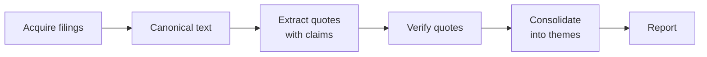
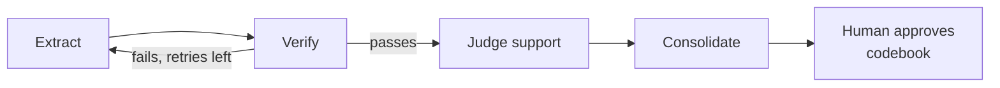

# Learning path: agentic Python for earnings themes with exact quotes

&#32;2026-09-21 · @Someone

## How to use this path

This path runs one project through eight stages, and each package arrives when you have already hit the problem it solves. Plan on about five weeks at a few focused hours a day.

Two premises set the order:

- Most of the system is a workflow, not an agent. [Anthropic's essay](https://www.anthropic.com/research/building-effective-agents) separates code paths you write in advance from a model choosing its own next step. Theme extraction from a known document is mostly the first kind.
- "Exact quotes" is the binding constraint. Code solves it. Prompting does not, and neither does a second LLM checking the first.

The project starts with one company's earnings release and ends with a sector over eight quarters. You start at Stage 0, because your LLM work so far has been through Claude Code and chat rather than an API.

Document types arrive in order. Stages 1–3 use 8-K press releases alone, and Stage 4 adds call transcripts and 10-Qs.

| Stage | Focus | Packages | Days |
| --- | --- | --- | --- |
| 0 | Frame the pipeline | none | 0.5 |
| 1 | Raw API and the agent loop | one provider SDK, edgartools | 3–4 |
| 2 | Quotes exact by construction | rapidfuzz, Claude Citations | 2–3 |
| 3 | Typed extraction | PydanticAI | 2–3 |
| 4 | Themes across documents | Polars, an embedding model | 4–6 |
| 5 | Orchestration | LangGraph, LangChain | 3–4 |
| 6 | Evaluation, then optimization | DSPy | 4–6 |
| 7 | Multi-agent comparison | CrewAI | 2 |

Each stage ends with a checkpoint. Tick it only when you can do the thing without notes.

## Stage 0: Frame it (half a day)

Decide which steps need a model before you write any code. Read the [essay](https://www.anthropic.com/research/building-effective-agents), then label each box below as plain code, a single LLM call, or a genuine loop.

Fewer of these boxes need a model than you would guess, and at most one needs a loop.

- [ ] Read the essay and note its workflow patterns: prompt chaining, routing, parallelization, orchestrator-workers, evaluator-optimizer.
- [ ] Label every box: code, single call, or loop.
- [ ] Match each LLM box to one of the essay's patterns.
- [ ] Checkpoint: you can defend every label out loud.

## Stage 1: Raw SDK, no framework (3–4 days)

Write the agent loop by hand once, and every framework afterward becomes readable. You have watched this loop for months: Claude Code calls a model, runs the tools it asks for, feeds the results back, and repeats.

| What you know from Claude Code | What it is in the API |
| --- | --- |
| Reading files, running commands | Tool definitions with JSON schemas, plus your code that executes them |
| CLAUDE.md and skills | Prompt text the harness loads into context |
| The session scrolling by | A messages list you append to and resend on every call |
| Subagents | Separate model calls, each with its own messages list |
| Compaction | Your job now: the context window is finite and you manage it |

Work with one provider's Python SDK. Learn in this order: a single message call, structured output, tool use, async concurrency.

- [ ] Make one call that summarizes a press release, and print the token usage.
- [ ] Hand-write the loop: call the model, run any tool calls, append the results, repeat until none remain.
- [ ] Give it two tools that wrap [edgartools](https://edgartools.readthedocs.io/en/latest/eightk-filings/): list a company's 8-K filings, and fetch a press release as text. Earnings releases sit under Item 2.02, with the release attached as exhibit EX-99.1.
- [ ] Naive baseline: pass a whole release, ask for themes with quotes as JSON, and measure the share of quotes that are exact substrings of the source.
- [ ] Checkpoint: you can describe any framework's "agent" object in terms of your own loop.

Expect the baseline to land short of 100%: stitched sentences, dropped words, tidied punctuation. Keep that number, because Stage 2 exists to make it 1.0.

Call transcripts are generally not filed on EDGAR. They come from vendors or investor-relations pages, so check licensing before you add them at Stage 4.

## Stage 2: Quotes exact by construction (2–3 days)

Make it impossible for the model to alter a quote, then compare three ways of doing it. This stage is the core of the path.

| Design | How it works | Trade-off |
| --- | --- | --- |
| Pointers | Number the sentences and keep character offsets. The model returns sentence IDs and your code slices the quote. | Exact by construction. Granularity is fixed at the sentence, and splitting financial text ("Inc.", "$1.2 billion") is its own small problem. |
| Generate, then verify | The model returns strings. Normalize unicode and whitespace, test substring membership, fuzzy-locate near misses with rapidfuzz, then snap to the true span or reject. | Flexible spans. Needs a retry path and a rejection rule. |
| API-native citations | Claude's [Citations](https://platform.claude.com/docs/en/build-with-claude/citations) feature splits plain text into sentences and returns cited text that points into the document you supplied. | It cannot be combined with structured outputs (the API returns a 400), so it forces two passes. Anthropic-only. |

Store each quote as (doc\_id, start, end) against a hashed canonical text. For transcripts add speaker and section, because an analyst's question is not management's claim.

Keep analyst questions as their own signal rather than discarding them. What analysts ask about shows which topics are hot, and management's answers show how the firm responds. Tag every transcript quote with a speaker role: management or analyst.

- [ ] Define "canonical text" once (HTML to text, normalized) and hash it.
- [ ] Build all three designs against the same five releases.
- [ ] Re-run the Stage 1 measurement. Every quote a design keeps should now be exact.
- [ ] Compare the designs on quotes lost, tokens spent, and span granularity.
- [ ] Checkpoint: you can explain why an LLM "fact-checker" is the wrong tool for exactness and the right one for judging whether a quote supports its theme.

## Stage 3: Typed extraction with PydanticAI (2–3 days)

Port the generate-then-verify design into [PydanticAI](https://ai.pydantic.dev/output). It is the lowest-abstraction framework on this path and the best fit for the extraction core.

You declare a Pydantic model as the agent's output type, and the run ends only when the model returns data that fits it. Output functions are validated by Pydantic, optionally with a validation context, and can raise `ModelRetry` to send the model back for another attempt.

- [ ] Model `Quote` and `Theme` as Pydantic classes.
- [ ] Pass the source text as the validation context, and turn a failed quote check into the retry message.
- [ ] Set a retry budget and a usage limit.
- [ ] Checkpoint: you have decided what happens when retries run out. Drop the quote; never patch it.

## Stage 4: Themes across documents (4–6 days)

Choose between a codebook you bring and one you discover, then freeze it. Without the freeze, theme prevalence over time is uninterpretable.

| Regime | Method |
| --- | --- |
| Deductive | You bring a codebook, a fixed list of theme definitions. Each verified quote gets multi-label classification. |
| Inductive | Map over documents to collect quote-claim pairs, then consolidate the claims into a codebook. Embeddings plus clustering is the non-LLM baseline (BERTopic is the usual one), and LLM consolidation is the alternative. Freeze and version the codebook, then re-code the whole corpus with it. |

The deliverable is a Polars frame of firm × quarter × doc\_type × speaker\_role × theme × quote\_id.

The other document types join here. Add call transcripts and 10-Qs for the same firms, each through a loader that emits the same canonical text and offsets. The payoff is comparison: set what the release says against the call and the 10-Q.

Most tutorials will push retrieval-augmented generation (RAG) here. A release or transcript fits in context whole, and a 10-K can be sectioned. Save retrieval for corpus-level lookups.

- [ ] Run both regimes on one sector for four quarters, using press releases.
- [ ] Add transcripts and 10-Qs for the same firms. Section each 10-Q to MD&A and risk factors first.
- [ ] Compare themes across the three document types for one firm-quarter.
- [ ] Code analyst questions separately from management remarks, then compare theme prevalence between the two.
- [ ] Write a rule for boilerplate: safe-harbor language, non-GAAP disclaimers.
- [ ] Write a rule for quotes that support two themes.
- [ ] Checkpoint: the codebook has a version number and every row of the frame records it.

## Stage 5: Orchestration with LangGraph (3–4 days)

Rebuild the pipeline as a state graph to get persistence, not intelligence. LangChain's own guidance points LangGraph at workflows that mix deterministic and agentic parts, which describes this project.

The retry edge is bounded, and a quote that exhausts its retries is dropped.

Compiled with a checkpointer, [LangGraph saves state at every step](https://docs.langchain.com/oss/python/langgraph/persistence). That makes human review, replay of earlier steps, and recovery from failures possible. Here it means resumable backfills over hundreds of filings and an approval gate on the codebook.

Use LangChain's `create_agent` for the one agentic piece: deciding which filings to fetch.

Warning: both libraries reached 1.0 on October 22, 2025. The [announcement](https://www.langchain.com/blog/langchain-langgraph-1dot0) moved legacy functionality into `langchain-classic`, deprecated `create_react_agent`, and promised no breaking changes until 2.0. Much of what search returns still teaches the old `AgentExecutor` style, so stick to the current docs.

- [ ] Port the Stage 3 extractor into graph nodes with a typed state.
- [ ] Add a SQLite checkpointer, kill a run halfway, and resume it.
- [ ] Add an interrupt that pauses for codebook approval.
- [ ] Build the filing-fetch agent with `create_agent` and your Stage 1 tools.
- [ ] Checkpoint: you can say honestly what the graph bought you over a function with a for-loop.

## Stage 6: Evaluation, then DSPy (4–6 days)

Build the metric first, because DSPy has nothing to optimize without one. Hand-code 20–40 documents with themes and supporting spans, and set aside a test split before you look at any results.

| Metric | What it answers |
| --- | --- |
| Exactness | Is every kept quote a verbatim span? It should be 1.0 by construction. |
| Support precision | Does the quote support its theme? Human spot checks, plus an LLM judge calibrated against them. |
| Theme recall | Did the run find the themes you coded? |
| Span overlap | How close are the model's spans to yours? Token-level F1 works. |
| Stability | Do k runs agree? Treat the model as a noisy coder and compute inter-rater agreement. |

Then rewrite extract and judge as DSPy signatures and modules. The division of labor matches a probabilistic programming language: you declare the program and the objective, and an engine does the search.

Try optimizers in order of cost, following [DSPy's selection guide](https://dspy.ai/current/diving-deeper/choosing-an-optimizer/):

1. `LabeledFewShot` and `BootstrapFewShot` as honest baselines.
2. `GEPA`, the only optimizer that reads written feedback from the metric. "Quote not found in source" is exactly that feedback, so your metric returns a score plus a critique.
3. `MIPROv2`, a Bayesian-optimization search over instructions and demos together.

Two cautions from that guide. Demo-tuning tends to overfit a small training set, while instruction-tuning tends to transfer. One GEPA or MIPROv2 compile can cost hundreds of dollars in LM calls, so start on the light budget and save the compiled program.

DSPy's API reference also lists an experimental [Citations](https://dspy.ai/current/api/experimental/Citations/) type. Read it before you port Stage 2.

- [ ] Hand-code the gold set and split it into train, dev, and test.
- [ ] Write the metric as a function that returns a score plus written feedback.
- [ ] Calibrate the LLM judge against 50 human labels and report the agreement.
- [ ] Run the pipeline k times and compute stability.
- [ ] Port extract and judge to DSPy. Run the baselines, then GEPA on a light budget.
- [ ] Checkpoint: you can explain why DSPy comes after evaluation, and you scored the test split exactly once.

## Stage 7: CrewAI, and knowing what not to use (2 days)

Build the task in CrewAI to learn when multi-agent autonomy earns its cost, which for extraction it rarely does. CrewAI's [current docs](https://docs.crewai.com/introduction) say to start any production application with a Flow. A Crew belongs inside a Flow step, only where the task needs autonomy.

| Build | Shape |
| --- | --- |
| Flow only | Event-driven steps with state: the same pipeline as Stage 5. |
| Flow with a Crew step | An analyst, a fact-checker, and an editor collaborate inside the extraction step. |

Score both against Stage 5 on cost, variance, and your Stage 6 metrics. Expect the crew to spend more tokens and add variance for no metric gain. Your verifier should be code, not a persona.

- [ ] Build the Flow-only version.
- [ ] Add the three-agent Crew inside the extraction step.
- [ ] Compare tokens, run-to-run stability, and metric scores across Stage 5 and both CrewAI builds.
- [ ] Checkpoint: you can name an earnings task where autonomy is justified. One candidate is investigating why a company's language shifted between quarters, with the agent choosing which filings to pull.

CrewAI publishes an official skill pack for coding agents, Claude Code included. See its [coding-agent guide](https://docs.crewai.com/en/guides/coding-tools/build-with-ai).

## Habits for every stage

Four habits keep the project reproducible and keep you learning rather than watching.

- Cache every response, keyed on model, prompt, and document hash.
- Record the model ID with every output, the way you would record a data vintage.
- Turn tracing on early. LangGraph pairs with LangSmith, and DSPy documents its own observability setup.
- Write Stages 1 and 2 by hand. From Stage 3 on, let Claude Code scaffold, but predict what it will write before you read it.

## Sources

Every package claim above comes from the project's own documentation, read on the as-of date. Two statements are my judgment rather than sourced fact: the expected shortfall in the Stage 1 baseline, and the expected result of the Stage 7 comparison.

| Stage | Page | Used for |
| --- | --- | --- |
| 0 | [Building effective agents](https://www.anthropic.com/research/building-effective-agents) (Anthropic) | Workflow versus agent, and the workflow patterns |
| 1 | [EdgarTools: 8-K current reports](https://edgartools.readthedocs.io/en/latest/eightk-filings/) | Item 2.02 and EX-99.1 press releases |
| 2 | [Citations](https://platform.claude.com/docs/en/build-with-claude/citations) (Claude Platform Docs) | Sentence chunking, valid pointers, the structured-outputs conflict |
| 3 | [Pydantic AI: Output](https://ai.pydantic.dev/output) | Output types, validation context, ModelRetry |
| 5 | [LangGraph: Persistence](https://docs.langchain.com/oss/python/langgraph/persistence) | Per-step checkpoints, human-in-the-loop, fault tolerance |
| 5 | [LangChain and LangGraph 1.0 announcement](https://www.langchain.com/blog/langchain-langgraph-1dot0) | The October 22, 2025 release, `langchain-classic`, the 2.0 pledge |
| 6 | [DSPy: choosing an optimizer](https://dspy.ai/current/diving-deeper/choosing-an-optimizer/) | Optimizer order, GEPA feedback, MIPROv2, overfitting and cost cautions |
| 7 | [CrewAI: Introduction](https://docs.crewai.com/introduction) | Start with a Flow; Crews inside Flow steps |
