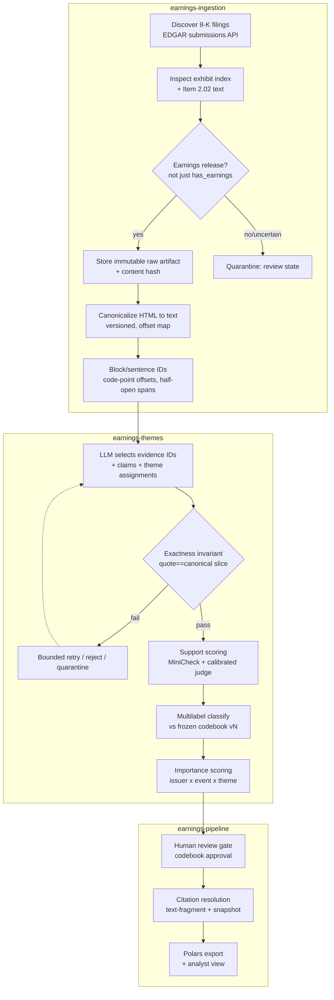

# Firm-Document Ingestion and Evidence-Linked Theme Analysis: A Methods Review and Implementable Research Design

*Research executed Tuesday, September 22, 2026. All web sources were searched and verified through this date. Software versions, API behaviors, and licenses are stated with verification dates; anything unverifiable is flagged.*

---

## TL;DR

- **Build a deterministic workflow, not an agent.** The LLM's only privileged jobs are to *select* pre-numbered evidence spans and *assign* themes; ordinary Python enforces exact-quote correctness by slicing canonical text (`quote_text == canonical_text[start:end]`) and resolves every citation to a durable, highlightable link. Both supplied notes already converge on this, and it is the design's load-bearing invariant.
- **The required path is fully free and open-source.** SEC EDGAR (no key) for 8-K main documents + EX-99.1 releases; EdgarTools (MIT); deterministic HTML→text canonicalization; a **pointer** evidence design; an open-weight embedding/reranker/NLI support stack (Qwen3-Embedding, BGE-reranker, MiniCheck — all Apache-2.0 or self-hostable); and a deductive-then-frozen codebook. No paid dataset, subscription, or billable inference is mandatory.
- **Treat provider-native citations and the Jev/TypeSafe option as optional, not core.** Anthropic's Citations feature still returns a **400** when combined with structured outputs (verified), and **Jev** (TypeSafe AI's closed, hosted, waitlisted "System One model," launched Sept 15 2026) cannot extract spans, generate quotations, or satisfy provenance requirements — it fits only as an optional typed *verification* layer and violates the free-access mandate, so it must be separately authorized and benchmarked before any adoption.

---

## Key Findings

1. **Exactness is a code invariant, not a model capability.** The attribution literature confirms this: on ALCE (Gao, Yen, Yu & Chen, EMNLP 2023, arXiv 2305.14627), "on the ELI5 dataset, even the best models lack complete citation support 50% of the time." *Generated* citations cannot be trusted for verbatim quoting; a pointer design (model returns span IDs, code slices the text) is exact by construction.
2. **Provider-native citations are a dead end for a typed pipeline.** Claude's Citations feature is verified (Claude Platform Docs, 2026-09-22) to return a 400 error when combined with structured outputs because "citations require interleaving citation blocks with text output, which is incompatible with the strict JSON schema constraints of structured outputs." This forces two passes and Anthropic lock-in.
3. **Separate three axes that are routinely conflated:** *exactness* (deterministic string identity), *source fidelity* (the canonical span faithfully represents the original), and *semantic support* (the quote actually supports the claim, with correct speaker/entity/period/modality). Only the first is deterministic; the second and third need sampling and calibrated models.
4. **A strong open-source support stack exists.** MiniCheck (Tang, Laban & Durrett, EMNLP 2024, arXiv 2404.10774) delivers "GPT-4-level performance but for 400x lower cost" at 770M parameters; AlignScore (Zha et al., ACL 2023, arXiv 2305.16739, 355M params, trained on 4.7M examples across 7 tasks) and SummaC (Laban et al., TACL 2022) are alternatives — but all are gameable and degrade on distributed evidence, so none is ground truth.
5. **"Fits in context" ≠ complete extraction.** "Lost in the Middle" (Liu et al., TACL 2024) and follow-ups establish a U-shaped positional-attention bias; exhaustive theme discovery needs structure-aware chunking plus direct measurement of omission, not reliance on long context or top-k retrieval.
6. **EdgarTools' `has_earnings` flag is not a complete detector.** Verified behavior: it returns True only when Item 2.02 is present **and** an EX-99.1 exhibit contains *parseable tables*, so narrative-only releases and alternative exhibit numbering are missed. Acquisition must inspect the actual exhibit index and item text.
7. **Transcripts are generally not on EDGAR and carry restrictive terms.** Free availability does not confer data rights (The Motley Fool's ToU prohibits scraping); transcripts must be a separately-scoped extension with a formal source register.

---

## Details

### 1. Executive recommendation and source audit

**Recommended approach.** Build the system as a deterministic workflow in which the LLM selects evidence IDs and assigns themes, and code enforces the exactness invariant and resolves citations. The `earnings-themes.md` premise — "exact quotes" is a constraint that "code solves… prompting does not, and neither does a second LLM checking the first" — is correct and load-bearing. The entire required path runs on free, lawfully-usable data and open-source software; an optional hosted-model comparison to establish a quality ceiling must be separately authorized and budgeted (this review authorizes no charges).

**Source-to-requirement audit — `earnings-ingestion.md`** is a company-universe/entity note that is **contextual**, not central. **Retain** its EDGAR/CIK identity backbone, issuer-vs-security distinction, point-in-time membership key (`universe_name + membership_as_of_date + issuer_CIK`), and its reference-date/retrieval-date and reported-vs-inferred provenance discipline as the identity/provenance layer. **Defer** its subsidiary/establishment/employment enrichment (Exhibit 21, GLEIF, OSHA, EPA TRI) — out of scope for document-theme analysis, and the prompt explicitly warns against a corporate-family census. **Retain** the SIC≠NAICS caution and the "approximately/FTE/reference-date" extraction discipline as the model for how *every* extracted datum must carry measure, scope, and date.

**Source-to-requirement audit — `earnings-themes.md`** is a five-week learning syllabus, not a production spec. Reclassified premises:

| Premise from note | Verdict | Reason |
|---|---|---|
| Workflow-first; at most one agentic step | **Retain** | Theme extraction from a known document is deterministic control flow. |
| Exactness solved by code, not prompting/second LLM | **Retain** | Load-bearing invariant. An LLM "fact-checker" is wrong for exactness (right for *support*). |
| Pointer vs generate-then-verify vs provider-native citations | **Test → prefer pointer** | Pointer is exact by construction. Claude Citations verified to still conflict with structured outputs (400), forcing two passes and lock-in. |
| PydanticAI as typed extraction core | **Retain (revise)** | Verified API (`ModelRetry`, validation context, `output_retries`). Keep as lowest-abstraction typed layer. |
| Freeze-and-version the codebook | **Retain** | Makes longitudinal prevalence interpretable; prevents future-information leakage. |
| Evaluation before optimization (DSPy) | **Retain (defer DSPy)** | Build metric/gold set first. GEPA/MIPROv2 compiles can cost hundreds of dollars; defer as optional. |
| Claude Citations as Stage-2 option | **Test/optional** | Anthropic-only; conflicts with structured outputs; quality-ceiling comparison only. |
| LangGraph for orchestration | **Revise → optional** | Useful only for persistence/resumable backfills and human-approval gate; checkpointed function is competitive. |
| CrewAI multi-agent | **Defer/reject** | The note itself concludes multi-agent rarely earns its cost for extraction. |
| 10-Q/transcript inclusion | **Retain as extension** | Keep 8-K + EX-99.1 as core corpus; transcripts/10-Qs are separately-scoped extensions. |

**Critical changes to the notes.** (1) Replace the Stage-1 "pass a whole release, ask for themes with quotes as JSON" with the pointer design at production time; generate-then-verify is a fallback, not the default. (2) Do not trust `has_earnings` to detect all earnings releases (verified narrower behavior above). (3) Harden the note's "check licensing" into a formal transcript source register with redistribution terms.

**Unresolved choices requiring experiments (not assertions):** whole-document vs chunked extraction for recall of briefly-mentioned themes; pointer vs generate-then-verify on lost-quotes/tokens/latency; deductive vs inductive-then-frozen codebook; and the ranking weight vector (hand-selected weights are provisional, not empirically optimal).

### 2. Critical methods review and comparison matrix

Throughout, I separate **independently-evaluated results** from **authors' own benchmarks**, **documentation-only capabilities**, and **untested proposals**, and flag preprints and vendor claims.

**2.1 Evidence-linking / attributable generation.** ALCE (Gao et al., EMNLP 2023, arXiv 2305.14627; code at princeton-nlp/ALCE) is the reproducible benchmark for citation-grounded generation, with automatic metrics for fluency, correctness, and citation quality (citation recall/precision via a TRUE-style NLI model). Its independently-reproduced headline — best models "lack complete citation support 50% of the time" on ELI5 — motivates why *generated* citations cannot be trusted for exactness. ALCE measures whether a *statement is entailed by cited passages* (**support**), a separate axis from **exactness**. The attribution survey (arXiv 2508.15396, preprint) confirms ALCE is the most-reused benchmark and that most attribution work targets *faithfulness of generation*, not verbatim-span exactness.

**2.2 Factual-consistency / support (NLI) models — for the *support* axis, never exactness.** MiniCheck (Tang, Laban & Durrett, EMNLP 2024, arXiv 2404.10774), best system MiniCheck-FT5 at 770M parameters, is reported to reach "GPT-4-level performance but for 400x lower cost," with a 4.3% absolute gain over AlignScore on the LLM-AggreFact benchmark and only a 0.4% drop without per-dataset threshold tuning (vs 9.2% for SummaC-CV). AlignScore (Zha et al., ACL 2023, arXiv 2305.16739) is a 355M-parameter unified alignment model trained on "4.7M training examples from 7 well-established tasks (NLI, QA, paraphrasing, fact verification, information retrieval, semantic similarity, and summarization)" that "matches or even outperforms metrics based on ChatGPT and GPT-4." SummaC (Laban et al., TACL 2022) is the foundational NLI-based baseline. **Critical caveat (independent):** "Do Automatic Factuality Metrics Measure Factuality?" and stress-tests show these metrics are gameable — appending constant innocuous phrases inflated SummaC-Conv by >0.2 absolute, and AlignScore/UniEval/MiniCheck degrade on distributed/long-range evidence. **Verdict:** use MiniCheck as the primary open-source support scorer and an LLM judge as a calibrated second signal, never as ground truth; keep exactness entirely separate and deterministic.

**2.3 Financial-NLP datasets/benchmarks (task-transfer evidence).** ECTSum (Mukherjee et al., EMNLP 2022, arXiv 2210.12467) — 2,425 earnings-call transcripts paired with Reuters bullet summaries — is the canonical earnings-call benchmark; per the FinLLMs survey (Lee et al., arXiv 2402.02315), "the task-specific SOTA model (47% on ROUGE-1) outperforms all LLMs" (ECT-BPS: ROUGE-1 0.467, ROUGE-2 0.307, ROUGE-L 0.514), and factual-numeric errors (dropping "adjusted" before EPS) are the core failure mode — directly relevant to GAAP/non-GAAP and sign/scale discipline. FinQA / TAT-QA / ConvFinQA cover numeric table-reasoning (relevant to storing table-cell evidence separately from narrative quotes). FinanceBench (2023, preprint) and FinBen (NeurIPS 2024 Datasets & Benchmarks) aggregate these as a menu of transfer tasks, not a winner-declaration. **Transfer limitation:** none evaluates *exact-quote evidence linking with durable passage anchors* — the project's core requirement — so they establish component plausibility, not end-to-end validation. That gap is what the Section 7 benchmark must fill.

**2.4 Theme discovery / topic modeling.** TopicGPT (Pham et al., NAACL 2024, arXiv 2311.01449) reports better alignment with human labels than baselines and does not require fixing *k*: "TopicGPT achieves post-refinement harmonic purity scores P1 of 0.74 and 0.57 on Wiki and Bills, respectively, compared to 0.64 and 0.52 for LDA, 0.58 and 0.39 for BERTopic, and 0.62 and 0.52 for SeededLDA"; its disagreements with ground truth were often genuinely multi-label documents, supporting a multilabel design. BERTopic (Grootendorst 2022) is a strong non-LLM inductive baseline, but **dependency flag:** it and its typical toolchain are **pandas-based** and HDBSCAN over-produces topics — keep it out of the application pipeline; run it offline for codebook discovery, review and freeze, then convert to Polars at the boundary. LDA/NMF remain strong classical baselines. **Verdict:** hybrid — inductive discovery (BERTopic and/or LLM consolidation, offline) → human-reviewed, versioned codebook → deductive multilabel classification with an explicit unknown/novel pathway. Prefer specific themes ("customers delaying large contracts") over generic ("business").

**2.5 Long-context vs chunking/retrieval.** "Lost in the Middle" (Liu et al., TACL 2024) and follow-ups (Hsieh et al. 2024; "Found in the Middle," MIT + Google 2024) independently establish a U-shaped positional-attention bias: accuracy for mid-context content degrades materially, and larger windows do not guarantee use of all tokens. **Implication:** "fits in context" does not guarantee complete extraction, and top-k retrieval is not adequate for *exhaustive* discovery. Use structure-aware chunking (speaker turns, sections) with hierarchical consolidation, and measure omission of briefly-mentioned important themes directly.

**2.6 Comparison matrix (reasoned shortlist).**

| Component | Recommended (open, free) | Strong alternative | Rejected / deferred | Evidence |
|---|---|---|---|---|
| Acquisition | EdgarTools 5.31.x (MIT) + direct EDGAR REST | raw `submissions`/`index.json` | sec-api.io (paid) | Docs + PyPI, 2026-09-22 |
| Exhibit selection | Inspect exhibit index + Item 2.02 text; not `has_earnings` alone | manual EX-99.x enumeration | "first exhibit = release" | EdgarTools docs |
| Canonicalization | Deterministic HTML→text (selectolax/lxml) + own offset map | sec-parser (semantic tree) | OCR (image-only) | sec-parser docs |
| Evidence linking | **Pointer** (model picks IDs; code slices) | generate-then-verify (rapidfuzz) | Claude Citations (SO conflict) | Anthropic docs |
| Support scoring | MiniCheck (open) + calibrated LLM judge | AlignScore / SummaC | any single infallible judge | EMNLP 2024 |
| Theme discovery | Inductive offline → frozen codebook | TopicGPT-style LLM topics | forcing fixed *k* in pipeline | NAACL 2024 |
| Classification | Deductive multilabel via PydanticAI | few-shot LLM | fine-tuning (only if labels justify) | PydanticAI docs |
| Embeddings/rerank | Qwen3-Embedding (Apache-2.0) + BGE-reranker-v2 (Apache-2.0) | multilingual-e5, BGE-M3 | closed APIs (optional ceiling) | Qwen3 report; MTEB |
| Passage links | Text fragments `#:~:text=` + fallback snapshot | W3C text-quote/position selectors | homepage/index links | MDN/WICG |
| Orchestration | Checkpointed Python function; LangGraph if backfill scale needs | LangGraph 1.x SQLite checkpointer | CrewAI multi-agent | LangChain docs |

### 3. End-to-end design

**3.1 Pipeline diagram.**



**3.2 Acquisition, document identification, event alignment.** Discover via the EDGAR `submissions` API (free, no key). SEC fair-access rules verified 2026-09-22: **≤10 requests/second aggregate**, a required descriptive **User-Agent** with contact (missing/generic → 403 and ~10-minute IP block), 429 on breach; use a ~0.12s inter-request delay and exponential backoff. EDGAR history goes back to 1994; filings accepted after 5:30 pm ET are dated the next business day. Start at **Item 2.02** ("Results of Operations and Financial Condition") with the release usually attached as **EX-99.1**, but **inspect the actual exhibit index, descriptions, and content** — verified real filings confirm the "On [date], the Company issued a press release … attached hereto as Exhibit 99.1" pattern is common but not universal. Handle multiple releases, alternative exhibit numbering, narrative-only releases (no parseable tables), 8-K/A amendments, and relevant non-earnings items. Do not hard-code "first exhibit," "every EX-99.1 is a release," or trust `has_earnings` as complete. Make explicit that core scope is **earnings-linked** Item 2.02 8-Ks; other material-event items are out of scope unless configured.

**Transcripts (source register).** Verified: transcripts are generally **not** filed on EDGAR.

| Source | Ownership | Access | Depth/coverage | Redistribution | Limitation |
|---|---|---|---|---|---|
| The Motley Fool | Motley Fool | Free web | 2007–present; selective, US | **ToU prohibits scraping**; counts against free article allowance | Selective; reading destination, not a data feed |
| Issuer IR / webcasts | Issuer | Free, per-issuer | Varies | Per-issuer terms | Inconsistent format; some audio-only |
| SEC (transcript as exhibit) | Issuer/SEC | Free | Rare | Public-domain filing | Uncommon; not reliable |
| Seeking Alpha / others | Third party | Login/paywall | US-centric | Restrictive | Not a free/permitted redistribution path |

**Verdict:** free availability does not confer data rights. Treat transcripts as an explicit extension: prefer issuer-published IR transcripts/webcasts under their terms; where only third-party transcripts exist and terms forbid redistribution, store evidence links and locally-computed features, not redistributed text. Label any audio-derived transcription (e.g., Whisper) as a separate, explicitly-scoped fallback — never an "original published transcript." Analyze missing-transcript coverage as a potential **selection-bias** source.

**Event/entity linkage.** Match on issuer identity (CIK), fiscal period, period end, earnings-event date, **and content** — never ticker or calendar quarter alone. Distinguish SEC acceptance time, first public availability, call time, fiscal reporting period, and retrieval time, preserving precision and unknowns. Deduplicate copies across EDGAR/IR/other without losing provenance; separate duplicate copies from genuinely additional disclosures; prevent amendments and later transcript revisions from leaking into point-in-time analyses. Maintain processing states: expected, unavailable, restricted, acquired, parsed, partial, failed, completed.

**3.3 Canonicalization.** Prefer native text; reserve OCR for image-only material (OCR-matched text is not a verified original quotation). Store an immutable raw artifact (content hash), a versioned canonical representation (canonicalizer version), and a source map between them. Preserve headings, paragraphs, lists, tables, footnotes, speaker turns, and section boundaries; handle Unicode/entities/whitespace/hyphenation/reading order/hidden or repeated content without silently changing meaning. Define offsets as **Unicode code points**, **half-open** `[start, end)`, over canonical text; the viewer uses the same convention. Do not invalidate offsets by removing boilerplate — retain it in the canonical representation and apply **analysis masks** (safe-harbor, non-GAAP disclaimers). Preserve numeric signs, units, scale, currencies, periods, column headers, GAAP/non-GAAP distinctions; store table-cell evidence and derived calculations separately from narrative quotes. A hash proves stability, not parsing correctness — require source-map/visual checks on a sample.

### 4. Formal ranking specification

**Primary ranking unit: issuer × earnings-event/fiscal-period × theme.** Document-level scores are diagnostics; sector/quarter are separate aggregations with explicit denominators. **Three separated meanings of "importance"** (never conflated with sentiment, frequency, or classifier confidence):
1. **Business significance** (proposed primary) — disclosed implications for performance, operations, strategy, risk; *not* an unsupported legal-materiality determination.
2. **Discourse salience** — emphasis, discussion share, repetition, analyst attention.
3. **Cross-firm prevalence** — share of eligible firms discussing a theme, with an observable denominator.

**Interpretable baseline (provisional, illustrative weights — NOT empirically optimal).** For theme *t* on issuer×event *e*, define an anchored 0–3 rubric per feature, then:

```
BusinessSignificance(e,t) = w1·magnitude + w2·guidance_relevance
                          + w3·persistence + w4·novelty
                          + w5·specificity + w6·mgmt_prioritization
```

each feature an anchored ordinal (0 = not disclosed/unknown, 3 = explicit, quantified, guidance-linked). Report salience and prevalence as **separate** vectors, never summed into significance. Rules:

- **Missing quantified impact is `unknown`, not `0`.** Keep it visible; do not let absence deflate a severe, infrequently-mentioned risk (those remain eligible for high importance).
- **Ordinal scores get no false numeric precision** — report rank **bands**; run sensitivity analysis over reasonable weight vectors and prompt/model runs, reporting ties/rank bands when orderings are unstable.
- **Anti-inflation:** deduplicate releases; collapse repeated prepared remarks; do not let long documents, verbose speakers, or multiple share classes inflate salience. Cross-document consistency is not independent corroboration.
- **Dissent handling:** contradicting evidence changes interpretation/uncertainty, not automatically importance; each is evidence-linked.
- **Evidence adequacy/confidence tracked separately** from importance; any gating justified and evidence-linked, with a rationale per material score component.
- **Sector aggregation:** define eligible population, missingness, coverage, weighting, denominators. Do not infer magnitude from quote counts, weight by employment by default, or claim population-wide effects from a selected sample. Stock-price reaction is an optional, confounded external validation — never ground-truth importance or proof of causality.

**Ranking method ladder:** interpretable rubric baseline → expert **pairwise** ranking (Bradley-Terry) → calibrated model-assisted ranking → supervised learning-to-rank only if labels justify it. Evaluate with expert pairwise agreement, nDCG (or a rare-event-sensitive alternative), and **recall of rare critical themes**, with uncertainty at sampling units that respect within-firm/event dependence.

### 5. Implementation contracts and representative Python

*Conventions: Python 3.x, Polars (never pandas), `pl.col('x').eq(1)`-style method calls, single quotes, two blank lines after defs, `uv`/Ruff/pytest. Each block labeled runnable / pseudocode / untested-integration.*

**5.1 Typed schemas (RUNNABLE — Pydantic v2).**

```python
from __future__ import annotations

from datetime import datetime
from enum import Enum
from typing import Optional

from pydantic import BaseModel, Field, model_validator


class SpeakerRole(str, Enum):
    management = 'management'
    analyst = 'analyst'
    operator = 'operator'
    unknown = 'unknown'


class SupportRelation(str, Enum):
    supports = 'supports'
    contradicts = 'contradicts'
    qualifies = 'qualifies'
    mentions_only = 'mentions_only'
    unknown = 'unknown'


class Issuer(BaseModel):
    cik: str                                   # zero-padded 10-digit, invariant key
    name: str
    sic: Optional[str] = None                  # SEC SIC, NOT NAICS
    universe_name: Optional[str] = None
    membership_as_of_date: Optional[datetime] = None


class EarningsEvent(BaseModel):
    event_id: str
    issuer_cik: str
    fiscal_period: str                         # e.g. 'FY2025Q3'
    period_end: Optional[datetime] = None
    earnings_event_date: Optional[datetime] = None
    call_time: Optional[datetime] = None


class SourceDocument(BaseModel):
    document_id: str
    issuer_cik: str
    event_id: Optional[str] = None
    role: str                                  # '8-K-main'|'EX-99.1'|'transcript'|'10-Q'
    accession: Optional[str] = None
    exhibit: Optional[str] = None
    original_url: str
    public_availability_ts: Optional[datetime] = None
    retrieval_ts: datetime
    rights_status: str = 'unknown'


class DocumentVersion(BaseModel):
    version_id: str
    document_id: str
    raw_hash: str
    canonical_hash: str
    canonicalizer_version: str
    is_amendment: bool = False


class DocumentBlock(BaseModel):
    block_id: str
    version_id: str
    section: Optional[str] = None
    speaker_role: SpeakerRole = SpeakerRole.unknown
    speaker_name: Optional[str] = None
    start: int                                 # code-point offset, half-open
    end: int
    is_boilerplate: bool = False               # masked in analysis, retained in source


class EvidenceSpan(BaseModel):
    span_id: str
    version_id: str
    block_id: str
    canonical_hash: str
    start: int
    end: int
    quote_text: str
    prefix: Optional[str] = None
    suffix: Optional[str] = None

    @model_validator(mode='after')
    def _bounds(self) -> 'EvidenceSpan':
        if self.end <= self.start:
            raise ValueError('span end must exceed start (half-open)')
        return self


class Claim(BaseModel):
    claim_id: str
    text: str
    issuer_cik: str
    event_id: Optional[str] = None


class ClaimEvidenceLink(BaseModel):
    claim_id: str
    span_id: str
    support: SupportRelation
    support_score: Optional[float] = None      # NOT calibrated unless validated


class ThemeDefinition(BaseModel):
    theme_id: str                              # stable across versions
    codebook_version: str
    label: str
    parent_id: Optional[str] = None            # hierarchy
    inclusion: str
    exclusion: str
    positive_examples: list[str] = Field(default_factory=list)
    negative_examples: list[str] = Field(default_factory=list)


class ThemeAssignment(BaseModel):
    assignment_id: str
    theme_id: str
    codebook_version: str
    claim_id: str
    is_novel: bool = False


class ThemeScore(BaseModel):
    event_id: str
    theme_id: str
    codebook_version: str
    business_significance_band: str            # rank band, not spurious precision
    salience: dict                             # separate vector
    prevalence: Optional[float] = None
    confidence: Optional[float] = None         # separate from importance
    rationale_span_ids: list[str] = Field(default_factory=list)
    weights_provisional: bool = True
    model_prompt_run_version: Optional[str] = None


class ProcessingCoverage(BaseModel):
    document_id: str
    state: str                                 # expected|unavailable|restricted|...
    reason: Optional[str] = None
```

**Relationships/invariants:** multiple `EvidenceSpan` per `Claim` (via `ClaimEvidenceLink`) and multiple `Claim`/`ThemeAssignment` per span, **without duplicating** the `SourceDocument`. Non-contiguous passages are separate spans, never stitched. Schema evolution: `codebook_version` and `canonicalizer_version` are carried on every dependent row so retrospective harmonization stays distinct from prospective fixed-codebook evaluation.

**5.2 Deterministic span validation (RUNNABLE — stdlib only).**

```python
import hashlib
import unicodedata


def canonical_hash(text: str) -> str:
    return hashlib.sha256(text.encode('utf-8')).hexdigest()


def validate_span(canonical_text: str, canonical_text_hash: str, start: int,
                  end: int, quote_text: str) -> None:
    """Deterministic exactness invariant. Raises on any violation.

    Exactness only: does NOT assert source fidelity or semantic support,
    which are evaluated separately.
    """
    if canonical_hash(canonical_text) != canonical_text_hash:
        raise ValueError('canonical text hash mismatch; version drift')
    if not 0 <= start < end <= len(canonical_text):
        raise ValueError('offsets out of range or not half-open')
    sliced = canonical_text[start:end]
    if not unicodedata.is_normalized('NFC', quote_text):
        raise ValueError('quote_text not NFC-normalized')
    if sliced != quote_text:
        raise ValueError('exactness violation: quote_text != canonical slice')
```

**5.3 Citation resolution (UNTESTED INTEGRATION).**

```python
from urllib.parse import quote


def text_fragment_url(base_url: str, quote_text: str, prefix: str | None = None,
                      suffix: str | None = None) -> str:
    """Build a W3C-style scroll-to-text fragment link.

    Verified support (2026-09-22): Chrome 80+, Edge 83+, Safari 16.1+,
    Firefox 131+. Degrades to page-top if text drifts, so NOT sufficient
    alone for durable evidence -> pair with a snapshot.
    """
    def enc(s: str) -> str:
        return quote(s, safe='')

    directive = 'text='
    if prefix is not None:
        directive += f'{enc(prefix)}-,'
    directive += enc(quote_text)
    if suffix is not None:
        directive += f',-{enc(suffix)}'
    return f'{base_url}#:~:text={directive}'
```

Store two links per evidence record: the original source URL and a durable application-hosted link that opens the exact passage with highlighting. When the publisher cannot support reliable passage links (or terms forbid rehosting text), fall back to a permitted immutable snapshot (do not imply the viewer already exists). Test repeated text (use prefix/suffix), source revisions, and wrong-occurrence errors; keep originals and snapshots distinguishable.

**5.4 Ranking interface (RUNNABLE — pure Python).**

```python
from dataclasses import dataclass, field


@dataclass(frozen=True)
class RankingWeights:
    magnitude: float = 0.25
    guidance_relevance: float = 0.20
    persistence: float = 0.15
    novelty: float = 0.15
    specificity: float = 0.10
    mgmt_prioritization: float = 0.15
    provisional: bool = True                   # hand-selected, NOT optimal


@dataclass
class FeatureVector:
    magnitude: int | None                      # None == unknown, NOT zero
    guidance_relevance: int
    persistence: int
    novelty: int
    specificity: int
    mgmt_prioritization: int
    rationale_span_ids: list[str] = field(default_factory=list)


def business_significance(fv: FeatureVector, w: RankingWeights) -> tuple[float, bool]:
    """Returns (score, has_unknown). Unknown magnitude is surfaced, not imputed."""
    has_unknown = fv.magnitude is None
    mag = 0 if has_unknown else fv.magnitude
    score = (w.magnitude * mag + w.guidance_relevance * fv.guidance_relevance
             + w.persistence * fv.persistence + w.novelty * fv.novelty
             + w.specificity * fv.specificity
             + w.mgmt_prioritization * fv.mgmt_prioritization)
    return score, has_unknown
```

**5.5 Polars export (RUNNABLE — requires `polars`).**

```python
import polars as pl


def export_analyst_frame(rows: list[dict]) -> pl.DataFrame:
    """Normalized firm x quarter x doc_type x speaker_role x theme x quote_id frame."""
    schema = {
        'issuer_cik': pl.Utf8,
        'fiscal_period': pl.Utf8,
        'doc_role': pl.Utf8,
        'speaker_role': pl.Utf8,
        'theme_id': pl.Utf8,
        'codebook_version': pl.Utf8,
        'span_id': pl.Utf8,
        'support': pl.Utf8,
        'significance_band': pl.Utf8,
        'confidence': pl.Float64,
    }
    frame = pl.DataFrame(rows, schema=schema)
    return frame.filter(pl.col('support').ne('mentions_only'))
```

**PydanticAI extraction core (UNTESTED INTEGRATION — verified API).** Declare `Quote`/`Theme` as the agent `output_type`; pass canonical source as the validation context; on a failed exactness check raise `ModelRetry` with the failure as the retry message; set `output_retries` and a usage limit; on exhaustion **drop** the quote (never patch). Verified 2026-09-22: PydanticAI output functions are Pydantic-validated with optional validation context, can take `RunContext`, and can raise `ModelRetry`; retry count/max are tracked on `RunContext`.

### 6. Architecture and data contracts (monorepo mapping)

- **`earnings-core`** — the twelve typed contracts above, provenance/hash primitives, the deterministic `validate_span` invariant, pure evidence/span logic. No I/O, no network.
- **`earnings-ingestion`** — EDGAR acquisition (EdgarTools + direct REST), exhibit inspection, event/entity resolution, immutable raw storage, canonicalization, source maps.
- **`earnings-themes`** — evidence selection, support scoring (MiniCheck + calibrated judge), codebooks, multilabel classification, ranking, evaluation.
- **`earnings-pipeline`** — config, CLI/workflows, resumability, human-review gates, reporting, Polars exports.

**Typed baseline vs optional tools.** The production dependency set is deliberately small: Polars, Pydantic/PydanticAI, an HTTP client, EdgarTools, an open-weight inference runtime. **LangGraph** (verified 1.0 on 2025-10-22; legacy → `langchain-classic`; `create_react_agent` deprecated; no-breaking-changes-until-2.0 pledge) is justified only for persistence/resumable backfills over hundreds of filings and the codebook-approval interrupt. **DSPy** (verified 2026 optimizers: `BootstrapFewShot`, `MIPROv2` Bayesian/TPE, `GEPA` reflective — an ICLR 2026 Oral reported to beat MIPROv2 by >10% and GRPO by up to 20% with up to 35× fewer rollouts) is an optional, later layer; a single GEPA/MIPROv2 compile can cost hundreds of dollars in LM calls, so not a default. **CrewAI** multi-agent is deferred/rejected. None should become mandatory production dependencies.

**The Jev/TypeSafe option — candidate extension only.** The prompt's "previously discussed Jev/TypeSafe option" refers to **Jev**, the first "System One model" from **TypeSafe AI** (founder Diogo Almeida, ex-OpenAI), launched **September 15, 2026**. Verified (primary: TypeSafe launch blog and docs; independent: Forkast, DataCamp, LangChain, Requesty, Beam.ai):

- **What it is:** a closed, hosted, proprietary API (not open-source/open-weight; "the same weights serve every account"). You POST a `state` plus typed `questions` evaluated in parallel; it returns typed probabilistic decisions with calibrated confidence and **no free-form text**. Three question types: **Choice** (one of up to 255 options), **Score** (ordered levels), **Noul** (yes/no probability). Endpoint `POST /v1/systemone`; 64k-token context (32k for state plus longest question); text-only input.
- **Access/cost:** early access, waitlisted as of launch (reachable via third-party gateways like OpenRouter/Requesty). Pricing (vendor): $0.042 per million input tokens; output tokens free ("too cheap to meter"); vendor cost-per-decision ≈ $0.0004. TypeSafe explicitly concedes it "can't prove it isn't subsidized."
- **What it cannot do — decisive here:** it cannot generate free-form text, extract spans, or explain its reasoning. Per Beam.ai (independent): "Can Jev extract data from documents? Not on its own, because extraction is a generation task and an LLM does the pulling." Its "cannot hallucinate" claim is narrow: it cannot return an off-schema/invalid value, but it can still pick the wrong option.
- **Evidence quality:** vendor accuracy (~67.8% on an internal 4-workflow benchmark) is measured as *agreement with the average of two frontier models*, not independent ground truth — vendor-admitted. One small independent test ("Every," relayed second-hand via Forkast): ~25× faster and ~580× cheaper than Claude on an extraction task (0.35s vs 8.83s/passage), catching 6 of 7 planted defects vs 7/7 for the frontier model. Do not conflate the vendor headline "193.6× faster / 444.6× cheaper" with the independent 25×/580× figures — different tests.
- **Data rights:** vendor Privacy Policy states inputs are not used to train/fine-tune and not disclosed except to service providers; general retention is not zero by default (zero-data-retention is enterprise-only); hosting US-only.

**Verdict on Jev:** a candidate extension, not a replacement for extraction or provenance. It fits exactly one spot: a fast, cheap, calibrated typed decision/verification layer for narrow yes/no or scored judgments (e.g., "does this span support this theme?" as a Noul, or routing/screening) — the hybrid pattern where an LLM extracts and Jev verifies. It cannot perform pointer-selection, quotation, or span-resolution, and cannot satisfy the exact-quote or citation-provenance requirements. Because it is closed/hosted/waitlisted/billable, it violates the free-to-access mandatory-path constraint and must remain optional, separately authorized, and benchmarked against the open MiniCheck+judge layer before any adoption. Its measured value on *this* task is currently unverified.

**Storage/ops:** immutable manifests; idempotent, selectively-reprocessable stages; caches keyed on all material inputs (model ID, prompt, document hash, canonicalizer/codebook versions); offline replay; bounded retries; budget controls; local-first observability. Treat downloaded documents as **untrusted data, not instructions** (prompt-injection defense). Keep restricted text/credentials out of inappropriate logs or external services. **Default CI must not require network or billable calls.**

### 7. Evaluation plan and staged roadmap

**Benchmark design.** An expert-annotated set spanning firms, sectors, periods, document types, layouts, Q&A structures, common themes, and rare high-importance events, deliberately including valid documents with **no qualifying themes**, unavailable sources, and parser failures. A 20–40-document pilot can establish feasibility, gross error modes, and inter-annotator agreement ranges, but cannot validate rare-event recall or stable ranking — those need a larger validation set. Independent annotation + adjudication for theme definitions, supporting spans, speaker/entity attribution, support relations, and importance; report agreement (Cohen's/Krippendorff's κ, with the caveat that subjective NLG tasks commonly sit at κ≈0.3–0.6) and genuine ambiguity. Split by issuer and time, keeping duplicate documents and complete event bundles within a single split; prevent leakage via codebook discovery, prompt optimization, repeated releases, and corrected future versions.

**Metrics and proposed acceptance criteria (thresholds PROPOSED until validated):** acquisition coverage; correct exhibit selection; parsing/table fidelity; speaker attribution; span precision/recall; theme micro/macro and hierarchical F1; semantic support; citation completeness (every substantive clause maps to ≥1 evidence record); exact-link resolution; abstention rate and retained coverage; run-to-run stability (treat the model as a noisy coder; compute inter-rater agreement across *k* runs). Accepted quotations must satisfy exactness deterministically (target 1.0 by construction); measure source fidelity and support separately. A system rejecting everything achieves exactness 1.0 but must fail usefulness — pair exactness with retained-coverage. Do not present unvalidated model confidence as a calibrated probability.

**LLM-as-judge calibration (verified best practice).** Calibrate the judge against 30–50+ expert labels; require judge-to-human κ above a pre-registered floor (independent guidance: below ~0.5 rework the rubric; agreeableness/position/verbosity/self-preference biases are documented); mitigate with cross-family judges, order-swapping, and 3–5 dimensions per call. Zheng et al., "Judging LLM-as-a-Judge with MT-Bench and Chatbot Arena" (NeurIPS 2023, arXiv 2306.05685), report that "strong LLM judges like GPT-4 can match both controlled and crowdsourced human preferences well, achieving over 80% agreement, the same level of agreement between humans" (from ~3K expert + 3K crowdsourced votes) — but only with locked rubrics and measured κ.

**Controlled baselines/ablations (measure quality, latency, memory, inference usage, total cost, maintenance):** whole-document vs chunked/retrieved extraction; pointer vs generate-then-verify quotes; codebook strategies (deductive vs inductive-then-frozen); deduplication on/off; transcript inclusion on/off; ranking-factor ablations; workflow vs multi-agent. **Adversarial tests:** wrong exhibits, duplicate passages, modified documents, negation, units/scale, wrong fiscal periods, analyst questions (attention ≠ occurrence), unsupported causal claims, prompt injection, omitted qualifiers, and important single mentions. Do not describe these planned experiments as completed results.

**Staged roadmap.**
1. **Simplest defensible baseline:** Dow-30 pilot; EdgarTools acquisition; deterministic canonicalization; pointer evidence with the exactness invariant; deductive codebook; interpretable rubric ranking; Polars export. Fully free/local.
2. **Strongest justified open-source design:** add inductive codebook discovery (offline BERTopic/LLM → frozen), MiniCheck + calibrated open-weight judge for support, Qwen3-Embedding + BGE-reranker for retrieval on 10-Q extensions, LangGraph only if backfill scale demands, expert pairwise ranking. Scale to S&P 500.
3. **Optional, explicitly-authorized hosted-model ceiling:** a frontier hosted LLM and/or Jev as a typed verification layer — budgeted and authorized separately; used only to bound achievable quality, never as a mandatory dependency.

### 8. A small worked example (real, accessible SEC documents)

**Source (verified original URL, sec.gov, fetched 2026-09-22):** Apple Inc. Form 8-K, EX-99.1, fiscal 2025 third quarter (period ended June 28, 2025): `https://www.sec.gov/Archives/edgar/data/320193/000032019325000071/a8-kex991q3202506282025.htm` (CIK 0000320193; accession 0000320193-25-000071).

**Short permitted quotations (verbatim from EX-99.1):**
- *"The Company posted quarterly revenue of $94.0 billion, up 10 percent year over year, and quarterly diluted earnings per share of $1.57, up 12 percent year over year."*
- Tim Cook (CEO): *"Today Apple is proud to report a June quarter revenue record with double-digit growth in iPhone, Mac and Services and growth around the world, in every geographic segment…"*
- Kevan Parekh (CFO): *"Our installed base of active devices also reached a new all-time high across all product categories and geographic segments…"*
- *"Apple's board of directors has declared a cash dividend of $0.26 per share of the Company's common stock."*

**Illustrative analyst-facing view** (labels/scores are **illustrative**, not computed; offsets/hashes/viewer links are **placeholders** — not fabricated real values):

| Rank band | Theme (hierarchy) | Supported claim | Importance + rationale | Salience | Confidence / coverage | Exact quotation | Speaker / doc / section | Link status |
|---|---|---|---|---|---|---|---|---|
| Band A | Revenue growth › total-company record | Q3 FY25 revenue $94.0B, +10% YoY; diluted EPS $1.57, +12% YoY | High — quantified magnitude + explicit record framing (illustrative) | High (headline + CEO) | High / EX-99.1 present | *"quarterly revenue of $94.0 billion, up 10 percent year over year…"* | Prepared release / EX-99.1 headline | Original ✅; text-fragment ✅ (illus.); snapshot ⧗ (viewer not built) |
| Band B | Services › all-time high | Services growth cited as record | Medium-High — strategic-mix signal (illustrative) | Medium | Medium | *"double-digit growth in iPhone, Mac and Services…"* | Management (Cook) / EX-99.1 | Original ✅; fragment ✅ (illus.) |
| Band C | Capital return › dividend | $0.26/share dividend declared | Medium — recurring capital-return datum (illustrative) | Low | High | *"cash dividend of $0.26 per share…"* | Prepared release / EX-99.1 | Original ✅ |

**Importance vs salience contrast:** the dividend is high-salience-low-novelty (recurring), while a briefly-mentioned supply or regulatory risk could be low-salience-high-significance — the ranking must keep the latter eligible for a high band. **Table-cell figures** (from the release's condensed financial statements) would be stored as `table-cell evidence`, separate from these narrative quotes, and never reassembled into a prose "quotation." A **matched transcript** is intentionally omitted: no permitted, redistributable free transcript source was verified for this event (Apple's own webcast/IR terms govern; third-party transcripts carry restrictive terms). Any synthetic edge cases (e.g., an analyst asking about layoffs to test attention≠occurrence) would be clearly separated from this real evidence.

### Reproducibility appendix

**Software/model/license verification (all verified 2026-09-22 unless noted):**
- **EdgarTools** — MIT; latest PyPI 5.31.5 (released 2026-05-22); 8-K `has_earnings` requires Item 2.02 + parseable EX-99.1 tables (doc-verified limitation). A v6.0 was announced for 2025-11-09 with in-5.x deprecation warnings.
- **SEC EDGAR** — free, no key; ≤10 req/s aggregate; required User-Agent with contact; 403 on missing UA, 429 on breach.
- **Anthropic Claude Citations** — verified to return 400 when combined with structured outputs (`output_config.format`); Anthropic-only; forces two passes.
- **PydanticAI** — `ModelRetry`, optional Pydantic validation context, `output_retries` tracked on `RunContext`.
- **LangChain/LangGraph** — 1.0 released 2025-10-22; legacy → `langchain-classic`; `create_react_agent` deprecated; no breaking changes until 2.0.
- **DSPy** — `BootstrapFewShot`, `MIPROv2` (Bayesian/TPE), `GEPA` (ICLR 2026 Oral); GEPA reported to beat MIPROv2 >10% and GRPO up to 20% with up to 35× fewer rollouts; single compile can cost hundreds of dollars (GEPA paper, arXiv 2507.19457).
- **BERTopic** — MIT; pandas-based — keep out of the Polars application pipeline; offline codebook aid only.
- **sec-parser** — semantic-tree HTML parser; candidate for structure-aware canonicalization; validate dependency footprint.
- **Open-weight models** — Qwen3-Embedding series (Apache-2.0; 0.6B/4B/8B; per QwenLM, "The 8B size embedding model ranks No.1 in the MTEB multilingual leaderboard (as of June 5, 2025, score 70.58)"); BGE-reranker-v2 (Apache-2.0); MiniCheck-FT5 (770M, Flan-T5, self-hostable). Weight license ≠ software license; verify each at adoption.
- **Browser text fragments** `#:~:text=` — Chrome 80+, Edge 83+, Safari 16.1+, Firefox 131+ (MDN 2026-06-22; caniuse); WICG draft, not a W3C standard; degrades to page-top on drift → pair with snapshot.
- **Jev/TypeSafe** — closed hosted API; launched 2025-09-15 (early access/waitlist); $0.042/Mtok input, output free; not open-weight; benchmarks vendor-run (agreement-with-frontier, not ground truth); one small second-hand independent test. Measured value on this task unverified.

**Literature-search scope:** SEC materials and original issuer 8-K/EX-99.1 filings; peer-reviewed/preprint financial-NLP (ECTSum EMNLP 2022 arXiv 2210.12467; FinLLMs survey arXiv 2402.02315; FinQA/TAT-QA/ConvFinQA; FinanceBench 2023; FinBen NeurIPS 2024 D&B); attribution/citation (ALCE EMNLP 2023 arXiv 2305.14627; attribution survey arXiv 2508.15396); factual-consistency/NLI (MiniCheck EMNLP 2024 arXiv 2404.10774; AlignScore ACL 2023 arXiv 2305.16739; SummaC TACL 2022; factuality-metric stress tests); topic modeling (TopicGPT NAACL 2024 arXiv 2311.01449; BERTopic 2022); long-context (Liu et al. TACL 2024 and follow-ups); LLM-as-judge (Zheng et al. NeurIPS 2023 arXiv 2306.05685); maintained tool documentation. Preprints and vendor claims labeled as such.

**Outstanding limitations / unverified items:** (1) end-to-end exact-quote-with-durable-anchor performance has **no** existing public benchmark — Section 7's benchmark must establish it; (2) transcript redistribution rights are source-specific and largely restrictive — coverage/selection bias unquantified; (3) all ranking weights are provisional; (4) the "Every" independent Jev test is second-hand and small-sample; (5) EdgarTools v6.0 behavior post-2025-11-09 is unverified against this design; (6) no benchmark numbers, prices beyond those quoted, offsets, hashes, computed scores, or working viewer links are asserted as real — illustrative items are labeled.

---

## Recommendations

**Recommended first implementation.** Build the **Dow-30 pilot** of the simplest defensible baseline: EdgarTools + direct EDGAR REST acquisition (with exhibit-index inspection, **not** `has_earnings` alone); immutable raw store + versioned canonical text with code-point half-open offsets; a **pointer** evidence design enforcing `quote_text == canonical_text[start:end]` deterministically; a small **deductive, frozen, versioned** codebook with an unknown/novel pathway; multilabel classification via PydanticAI typed output with bounded `ModelRetry` and drop-on-exhaustion; an **interpretable rubric** ranking at issuer×event×theme with provisional weights, unknown≠zero, and rank bands; browser text-fragment links plus a planned snapshot fallback; and a normalized **Polars** export feeding the analyst view. Everything free/local; CI offline; documents treated as untrusted. Only after this baseline passes its acceptance gates should you add the Stage-2 open-source enhancements (inductive discovery, MiniCheck support scoring, embeddings/reranker, LangGraph persistence), and only with separate authorization should you run the Stage-3 hosted-model or Jev ceiling comparison.

**Evidence that would change this recommendation.**
- **Pointer design underperforms:** if an ablation shows pointer selection has materially worse theme/span recall than generate-then-verify at equal exactness, shift the default — but never let approximate matches pass as exact.
- **Whole-document extraction proves complete:** if long-context whole-document extraction achieves rare/briefly-mentioned-theme recall on par with structure-aware chunking (contra "lost in the middle"), drop chunking complexity.
- **Open support layer is inadequate:** if MiniCheck + calibrated open judge cannot reach the pre-registered support-precision floor, authorize a budgeted hosted-model (or Jev-as-verifier) comparison — adopt only if it clears the floor at acceptable cost.
- **Provider-native citations change:** if a provider removes the structured-output/citations conflict and exposes verifiable character-level spans, re-evaluate provider-native citations against the pointer design.
- **Ranking instability:** if expert pairwise agreement and nDCG are unstable across reasonable weight vectors and model runs, defer numeric ranking to rank bands only and invest in learning-to-rank once sufficient labels exist.
- **Codebook drift:** if prospective fixed-codebook evaluation shows high novel-theme rates, trigger a governed codebook version bump with full recode — never silently extend a frozen codebook mid-analysis.

---

## Caveats

- **No end-to-end performance numbers are asserted.** No public benchmark evaluates exact-quote evidence linking with durable passage anchors on earnings documents; every metric threshold in Section 7 is *proposed*, not validated. All scores, offsets, hashes, and viewer links in the worked example are explicitly labeled illustrative or placeholder.
- **Support models are not ground truth.** MiniCheck/AlignScore/SummaC are demonstrably gameable and degrade on distributed evidence; treat them as calibrated signals paired with human spot-checks, never as verdicts. LLM-as-judge outputs are not calibrated probabilities without measured κ against expert labels.
- **Vendor vs independent evidence is kept distinct.** Jev's ~67.8% accuracy and 193.6×/444.6× headline figures are vendor-run (accuracy measured as agreement with frontier models, not ground truth); the 25×/580× extraction figures are a small, second-hand independent test. Jev's value on this specific task is unverified, and it violates the free-access mandate, so it stays optional.
- **Transcript rights are the largest data-access risk.** Free viewability does not grant redistribution rights (Motley Fool's ToU prohibits scraping), and transcripts are generally absent from EDGAR; missing-transcript coverage may introduce selection bias that must be measured, not assumed away.
- **Framework and version drift.** LangChain/LangGraph reached 1.0 (2025-10-22) with a 2.0 breaking-change pledge, and EdgarTools v6.0 was slated for 2025-11-09; both should be re-verified before pinning. Keep the production dependency set minimal and treat LangGraph/DSPy/CrewAI as optional.
- **Ranking is provisional by construction.** Hand-selected weights are not empirically optimal; report rank bands, run sensitivity analysis, and keep severe-but-rare risks eligible for high importance (missing quantified impact is *unknown*, not zero).